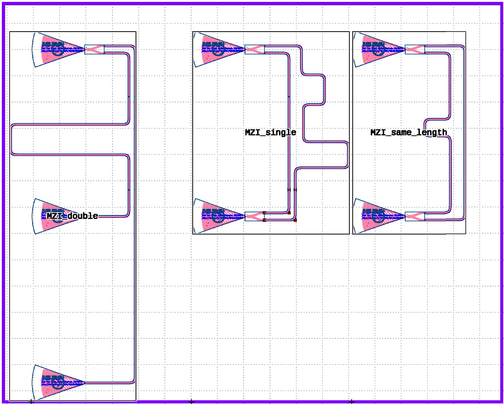
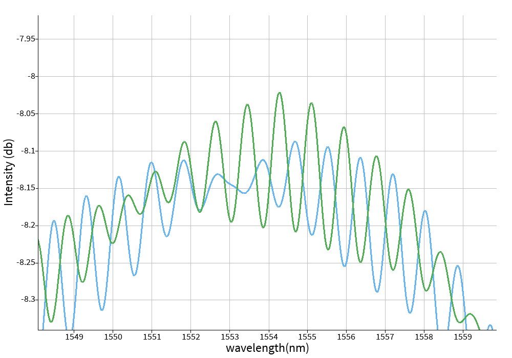
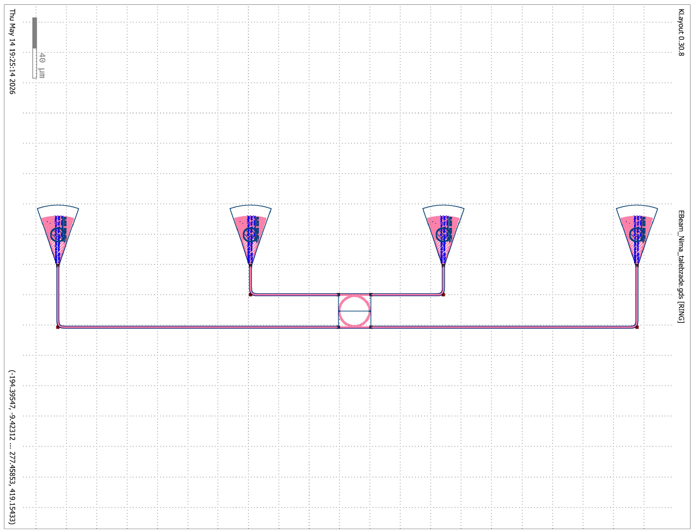
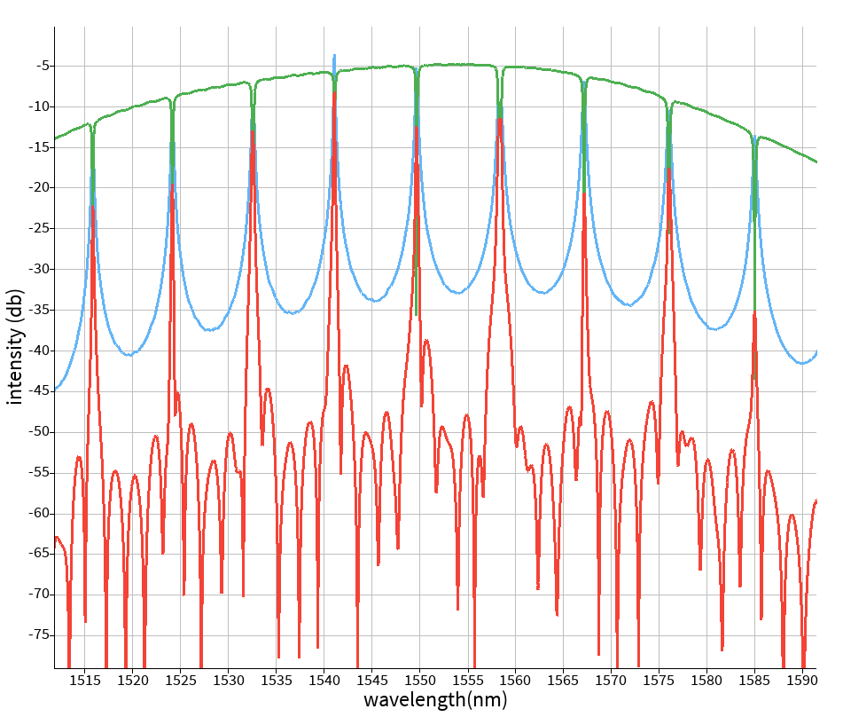
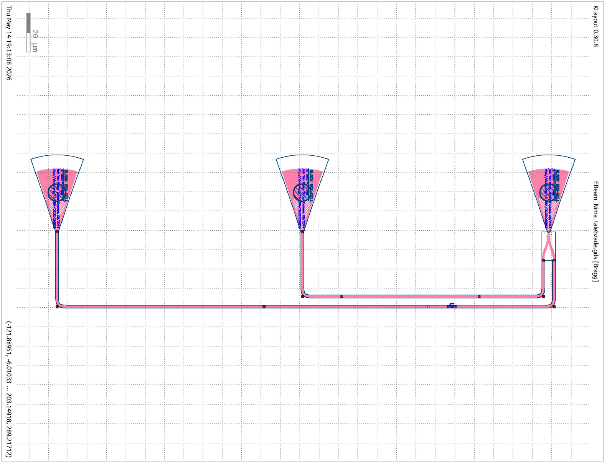
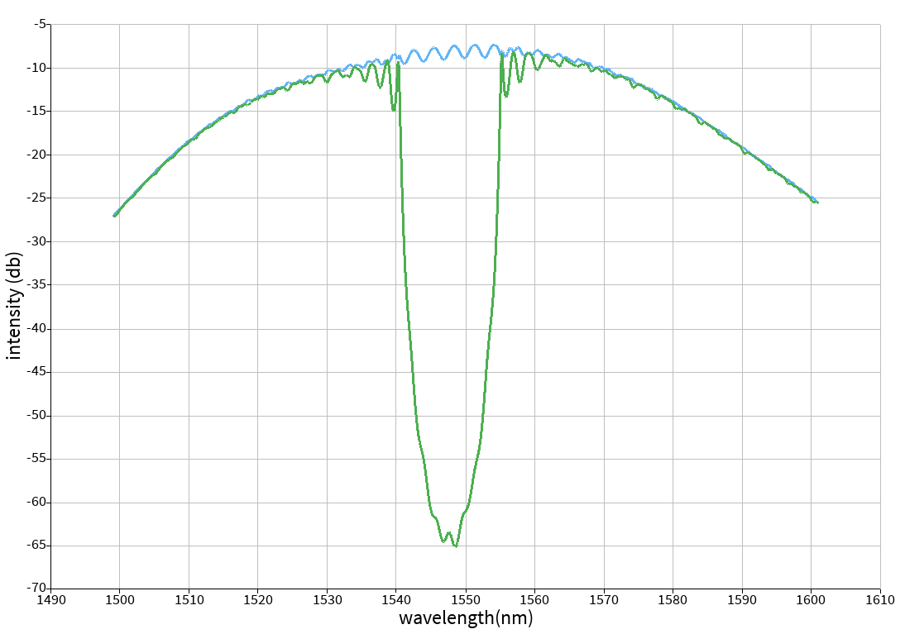
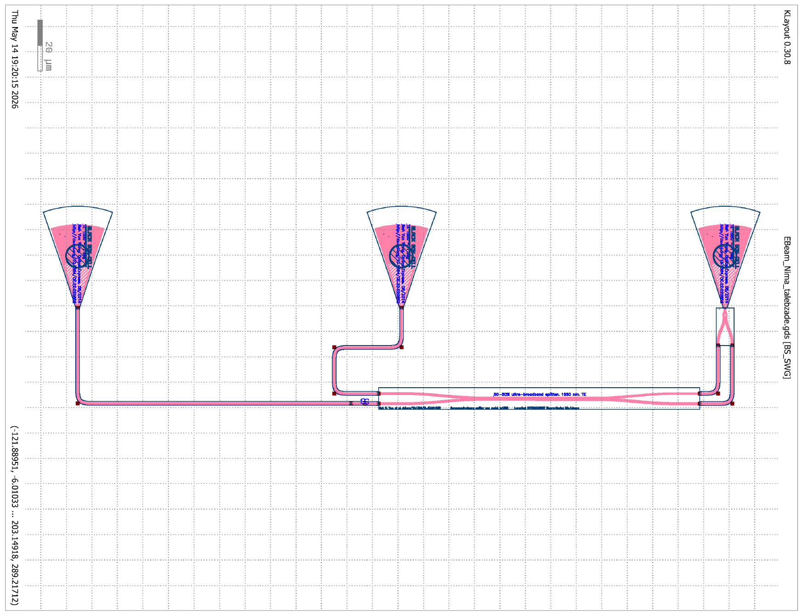
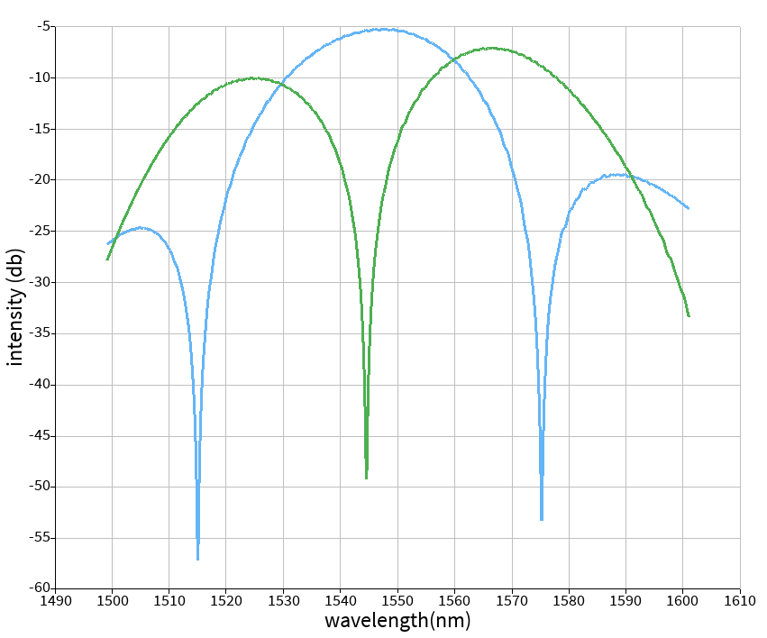

# Silicon Photonics PIC Design

This repository contains photonic integrated circuit (PIC) layouts and simulation studies developed using KLayout and ANSYS Lumerical.

The work includes:
- Mach-Zehnder Interferometer (MZI)
- Ring Resonator
- Bragg Reflector
- Ultra Broadband Splitter

All layouts were verified through GDS checks.

---

# Tools Used

- KLayout
- ANSYS Lumerical
- GDS Layout Verification

---

# Components

## 1. Mach-Zehnder Interferometer (MZI)

### Layout

### Simulation Result (one of the samples-MZI_single)

---

## 2. Ring Resonator

### Layout

### Simulation Result

---

## 3. Bragg Reflector

### Layout

### Simulation Result

---

## 4. Ultra Broadband Splitter

### Layout

### Simulation Result

---

# Author

Nima Talebzadeh  
Photonics | TPV Systems | Optical Simulations | Silicon Photonics
